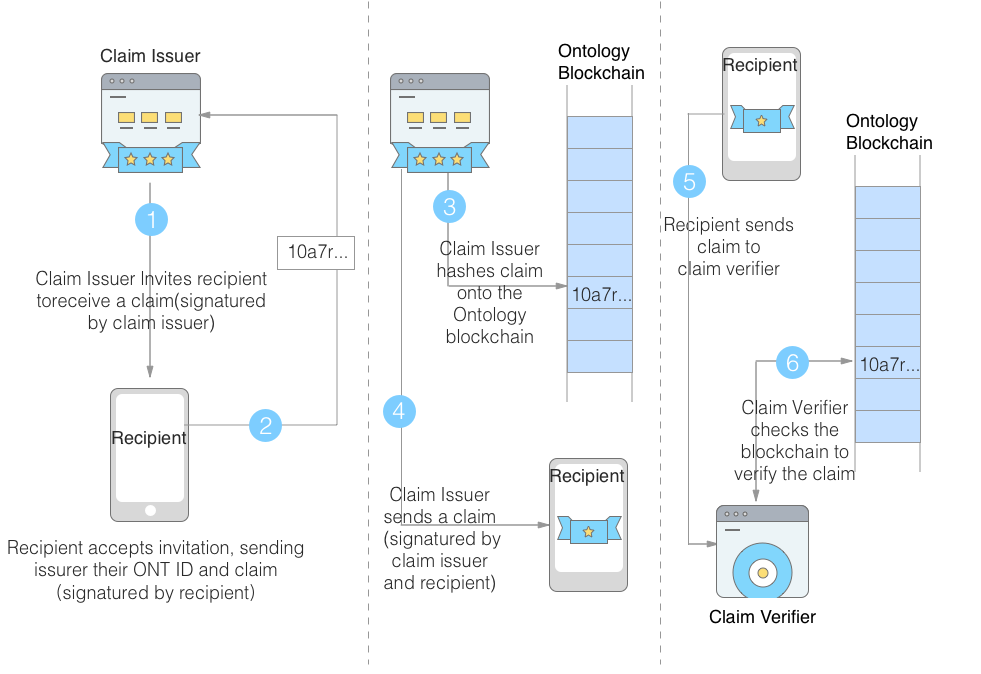

# Digital Identity

## Digital Identity lifecycle

* choose wallet file

``` java
//If the wallet file does not exist, a wallet file will be auto-generated.
wm.openWalletFile("Demo3.json");
```

* Register a digital identity

``` java
Identity identity = ontSdk.getWalletMgr().createIdentity("password");
//The account or identity created is stored in the memory only and a write api is required to write it to the wallet file.
ontSdk.getWalletMgr().writeWallet();
```

writeWallet is just write the ID to walle file.

``` java
    public Wallet writeWallet() throws Exception {
        writeFile(filePath, JSON.toJSONString(walletInMem));
        walletFile = walletInMem.clone();
        return walletFile;
    }
```

* Register a digital identity to blockchain

``` java
Identity identity = ontSdk.getWalletMgr().createIdentity(password);
Transaction tx = ontSdk.nativevm().ontId().makeRegister(identity.ontid,password,salt,payerAcc.address,ontSdk.DEFAULT_GAS_LIMIT,0);
ontSdk.signTx(tx,identity.ontid,password,salt);
ontSdk.getConnect().sendRawTransaction(tx);
```

* Remove identity

``` java
ontSdk.getWalletMgr().getWallet().removeIdentity(ontid);
//wrote to wallet
ontSdk.getWalletMgr().writeWallet();
```

* Set default account or identity

``` java
ontSdk.getWalletMgr().getWallet().setDefaultIdentity(index);
ontSdk.getWalletMgr().getWallet().setDefaultIdentity(ontid);
```

## DDO lifecycle

* get DDO

DDO of blockchain-based identity can be queried by entering ONT ID.

``` java
//get DDO by entering ONT ID
String ddo = ontSdk.nativevm().ontId().sendGetDDO(ontid);
-----------
result：
{
    "Attributes": [{
        "Type": "String",
        "Value": "value1",
        "Key": "key1"
    }],
    "OntId": "did:ont:TA5UqF8iPqecMdBzTdzzANVeY8HW1krrgy",
    "Recovery": "TA6AhqudP1dcLknEXmFinHPugDdudDnMJZ",
    "Owners": [{
        "Type": "ECDSA",
        "Curve": "P256",
        "Value": "12020346f8c238c9e4deaf6110e8f5967cf973f53b778ed183f4a6e7571acd51ddf80e",
        "PubKeyId": "did:ont:TA5UqF8iPqecMdBzTdzzANVeY8HW1krrgy#keys-1"
    }, {
        "Type": "ECDSA",
        "Curve": "P256",
        "Value": "1202022fabd733d7d7d7009125bfde3cb0afe274769c78fd653079ecd5954ae9f52644",
        "PubKeyId": "did:ont:TA5UqF8iPqecMdBzTdzzANVeY8HW1krrgy#keys-2"
    }]
}
```

* Update DDO attribute

``` java
Transaction tx = ontSdk.nativevm().ontId().makeAddAttributes(ontid,password,salt,attributes,payer,gaslimit,0);
ontSdk.signTx(tx,identity.ontid.replace(Common.didont,""),password);
ontSdk.getConnectMgr().sendRawTransaction(tx);
```

* Remove DDO Attribute

``` java
Transaction tx = ontSdk.nativevm().ontId().makeRemoveAttribute(ontid,password,salt,path,payer,gaslimit,0);
ontSdk.signTx(tx,identity.ontid,password);
ontSdk.getConnectMgr().sendRawTransaction(tx);
```

## OntID Publickey lifecycle

* Add Publickey

``` java
// if need recover add using following api:
// endAddPubKey(String ontid,String recoveryAddr, String password,byte[] salt, String newpubkey,Account payerAcct,long gaslimit,long gasprice)
//
Transaction tx = ontSdk.nativevm().ontId().makeAddPubKey(ontid,password,salt,newpubkey,payer,gas);
ontSdk.signTx(tx,identity.ontid.replace(Common.didont,""),password);
ontSdk.getConnectMgr().sendRawTransaction(tx);
```

* Remove Publickey

``` java
Transaction tx = ontSdk.nativevm().ontId().makeRemovePubKey(ontid,password,salt,removePubkey,payer,gas);
ontSdk.signTx(tx,identity.ontid,password);
ontSdk.getConnectMgr().sendRawTransaction(tx);
```

## Ontid recovery

* Add recovery address

``` java
Transaction tx = ontSdk.nativevm().ontId().makeAddRecovery(ontid,password,salt,recovery,payer,gas);
ontSdk.signTx(tx,identity.ontid,password);
ontSdk.getConnectMgr().sendRawTransaction(tx);
```

* Recovery

``` java
String sendChangeRecovery(String ontid, String newRecovery, String oldRecovery, String password,salt,long gaslimit,long gasprice)
```

# Verifiable Claim

The entire workflow of the verifiable claim is shown in the figure below. It contains three major parts:

* Request claim;
* Issue claim;
* Verify claim.



* Claim has the following data structure:

``` java
class Claim{
  header : Header
  payload : Payload
  signature : byte[]
}
```

``` java
class Header {
    public String Alg = "ONT-ES256";
    public String Typ = "JWT-X";
    public String Kid;
    }
```

`alg` attribute specifies the signature scheme to use. A list of supported values can be found here.
`typ` attribute can take one of the two values:

    * JWT: This corresponds to the case that blockchain proof is not contained in the claim.
    * JWT-X: This corresponds to the case that blockchain proof is a part of the claim.

`kid`  attribute refers to the public key used for signature verification. It has the form <ontID>#keys-<id> as defined in ONT ID specification.

``` java
class Payload {
    public String Ver;
    public String Iss;
    public String Sub;
    public long Iat;
    public long Exp;
    public String Jti;
    @JSONField(name = "@context")
    public String Context;
    public Map<String, Object> ClmMap = new HashMap<String, Object>();
    public Map<String, Object> ClmRevMap = new HashMap<String, Object>();
    }
```

`ver` attribute specifies the version of the claim spec it follows.

`iss` attribute refers to the ONT ID of the issuer.

`sub` attribute refers to the ONT ID of the recipient.

`iat` attribute marks the time the claim was created and has the format of unix timestamp.

`exp` attribute marks the expiration time of the claim and has the format of unix timestamp.

`jti` attribute specifies the unique identifier of the verifiable claim.

`@context` attribute specifies the uri of claim content definition document which defines the meaning of each field and the type of the value.

`clm` attribute is an object which contains the claim content.

`clm-rev` attribute is an object which defines the revocation mechanism the claim use.

* createOntIdClaim

``` java
Map<String, Object> map = new HashMap<String, Object>();
map.put("Issuer", dids.get(0).ontid);
map.put("Subject", dids.get(1).ontid);
Map clmRevMap = new HashMap();
clmRevMap.put("typ","AttestContract");
clmRevMap.put("addr",dids.get(1).ontid.replace(Common.didont,""));
String claim = ontSdk.nativevm().ontId().createOntIdClaim(dids.get(0).ontid,password,salt, "claim:context", map, map,clmRevMap,System.currentTimeMillis()/1000 +100000);
```

* verifyOntIdClaim

``` java
Map<String, Object> map = new HashMap<String, Object>();
map.put("Issuer", dids.get(0).ontid);
map.put("Subject", dids.get(1).ontid);

Map clmRevMap = new HashMap();
clmRevMap.put("typ","AttestContract");
clmRevMap.put("addr",dids.get(1).ontid.replace(Common.didont,""));

String claim = ontSdk.nativevm().ontId().createOntIdClaim(dids.get(0).ontid,password,salt, "claim:context", map, map,clmRevMap,System.currentTimeMillis()/1000 +100000);
boolean b = ontSdk.nativevm().ontId().verifyOntIdClaim(claim);
```